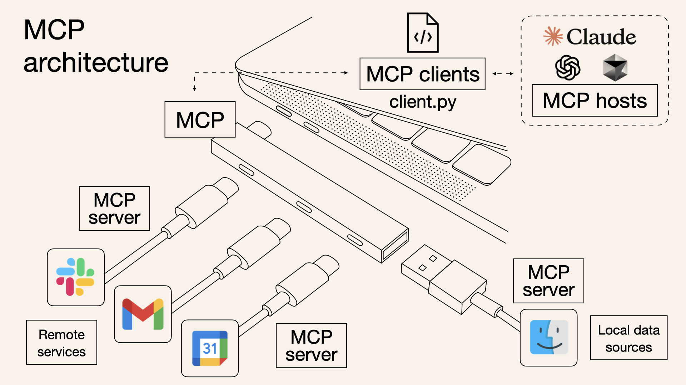

# Introduction

[What is Model Context Protocol (MCP)? How it simplifies AI integrations compared to APIs | AI Agents That Work](https://norahsakal.com/blog/mcp-vs-api-model-context-protocol-explained/)

- The Model Context Protocol (MCP) is a standardized protocol that connects AI agents to various external tools and data sources. Imagine it as a USB-C port - but for AI applications.
- **Metaphorically Speaking:** APIs are like individual doors - each door has its own key and rules
    - With Traditional API Need to do seperate Integration for each API

### MCP vs. API: Quick comparison

| Feature | MCP | Traditional API |
| --- | --- | --- |
| **Integration Effort** | Single, standardized integration | Separate integration per API |
| **Real-Time Communication** | ✅ Yes | ❌ No |
| **Dynamic Discovery** | ✅ Yes | ❌ No |
| **Scalability** | Easy (plug-and-play) | Requires additional integrations |
| **Security & Control** | Consistent across tools | Varies by API |

### Features of MCP

1. Single Protocol - standardized “connector”
    - Integrating one MCP means access to multiple tools and service
2. Dynamic Discovery - dynamically discover and interact with a tool
3. 2-way communication - real time two way connection like websocket
    - **Pull data:** LLM queries servers for context → e.g. checking your **calendar**
    - **Trigger actions:** LLM instructs servers to take actions → e.g. **rescheduling meetings**, **sending emails**

### Architecture

- **MCP Hosts:** These are applications (like Claude Desktop or AI-driven IDEs) needing access to external data or tools
- **MCP Clients:** They maintain dedicated, one-to-one connections with MCP servers
- **MCP Servers:** Lightweight servers exposing specific functionalities via MCP, connecting to local or remote data sources
- **Local Data Sources:** Files, databases, or services securely accessed by MCP servers
- **Remote Services:** External internet-based APIs or services accessed by MCP servers

**Visualizing MCP as a bridge makes it clear:** MCP doesn't handle heavy logic itself; it simply coordinates the flow of data and instructions between AI models and tools.